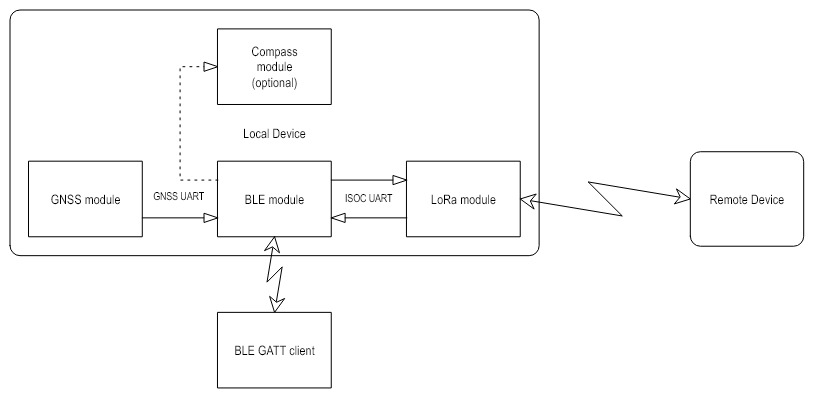
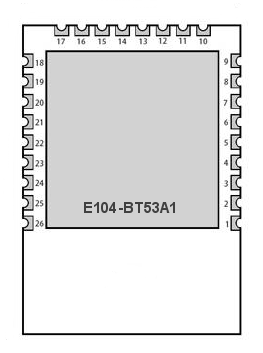
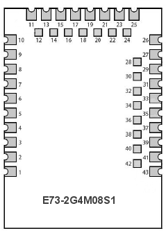

## Bluetooth Low Energy DLS (Double Location Service) for BLE SOC modules from EByte

The service includes characteristics with the coordinates of the location of local and remote devices, as well as a number of characteristics for configuring modules.
Personal firmware provides the same service functionality for all BLE modules based on SOC from different manufacturers.

---
### Simplified module connection diagram



---
### BLE DLS description

| UUID | UUID Description | Value or Value Description |
| :------ | :------ | :------ |
| 0x2800 | GATT Primary Service Declaration | 13:D6:12:50:FC:2D:03:87:5E:46:CA:94:00:14:82:7B |
| 0x2803 | GATT Characteristic Declaration | 10:10:00:13:D6:12:50:FC:2D:03:87:5E:46:CA:94:01:14:82:7B |
| 0x7B82140194CA465E87032DFC5012D613 | Device Location | [44 Bytes](#location) |
| 0x2902 | Client Characteristic Configuration | Write 01:00(Notifications) 02:00(Indications) |
| 0x2803 | GATT Characteristic Declaration | 10:10:00:13:D6:12:50:FC:2D:03:87:5E:46:CA:94:02:14:82:7B |
| 0x7B82140294CA465E87032DFC5012D613 | Remote Location | [44 Bytes](#location) |
| 0x2902 | Client Characteristic Configuration | Write 01:00(Notifications) 02:00(Indications) |
| 0x2803 | GATT Characteristic Declaration | 0A:16:00:13:D6:12:50:FC:2D:03:87:5E:46:CA:94:03:14:82:7B |
| 0x7B82140394CA465E87032DFC5012D613 | Settings | [14 Bytes](#settings) |
| 0x2803 | GATT Characteristic Declaration| 0A:18:00:13:D6:12:50:FC:2D:03:87:5E:46:CA:94:04:14:82:7B |
| 0x7B82140494CA465E87032DFC5012D613 | AES Key | [16 Bytes](#aes-key) |
| 0x2803 | GATT Characteristic Declaration | 02:1A:00:13:D6:12:50:FC:2D:03:87:5E:46:CA:94:05:14:82:7B |
| 0x7B82140594CA465E87032DFC5012D613 | LoRa Module Name | Variable ASCII text string up to 30 Bytes |
| 0x2803 | GATT Characteristic Declaration | 02:1C:00:13:D6:12:50:FC:2D:03:87:5E:46:CA:94:06:14:82:7B |
| 0x7B82140694CA465E87032DFC5012D613 | LoRa Core Name | Variable ASCII text string up to 30 Bytes |
| 0x2803 | GATT Characteristic Declaration | 10:1E:00:13:D6:12:50:FC:2D:03:87:5E:46:CA:94:07:14:82:7B |
| 0x7B82140794CA465E87032DFC5012D613 | RSSI of Noise | [2 Bytes](#rssi) |
| 0x2902 | Client Characteristic Configuration | Write 01:00(Notifications) 02:00(Indications) |
| 0x2803 | GATT Characteristic Declaration | 10:21:00:13:D6:12:50:FC:2D:03:87:5E:46:CA:94:08:14:82:7B |
| 0x7B82140894CA465E87032DFC5012D613 | RSSI of Last Packet | [2 Bytes](#rssi) |
| 0x2902 | Client Characteristic Configuration | Write 01:00(Notifications) 02:00(Indications) |


#### Location
```C
typedef struct
{
  uint16_t year;
  uint8_t  month;
  uint8_t  day;
  uint8_t  hours;
  uint8_t  minutes;
  uint8_t  seconds;
} geo_date_time_t;

typedef struct
{
  uint8_t          satellites;
  int32_t          latitude;             // 1e-7
  int32_t          longitude;            // 1e-7
  uint32_t         horizontal_accuracy;  // 1e-2
  int32_t          altitude;             // 1e-2
  uint32_t         vertical_accuracy;    // 1e-2
  int32_t          bearing;              // 1e-2
  uint32_t         bearing_accuracy;     // 1e-2
  int32_t          speed;                // 1e-1
  uint32_t         speed_accuracy;       // 1e-1
  geo_date_time_t  utc_time;
} geo_location_t;
```

#### Settings
```C
typedef struct
{
  uint32_t  frequency;
  uint8_t   bandwidth;
  uint8_t   spreading_factor;
  uint8_t   coding_rate;
  uint8_t   interval;
  int16_t   rssi_channel_busy;
  int32_t   magnetic_declination;
} ble_dls_remote_settings_t;
```

#### AES Key
```C
typedef struct
{
  uint8_t   aes_key[16];
} ble_dls_remote_aes_key_t;
```

#### RSSI
```C
typedef struct
{
  int16_t   rssi;
} ble_dls_rssi_t;
```

---
### Hardware

List of tested BLE SOC modules from EByte:
| Module | SOC | CPU core | DLS firmware | Toolchain |
| :------ | :------ | :------ | :------: | :------: |
| E104-BT53A1 | EFR32BG22C112F352 | ARM Cortex-M33 | &check; | IAR EW ARM<br>Simplicity Studio |
| E73-2G4M08S1C | nRF52840 | ARM Cortex-M4F | &check; | IAR EW ARM<br>nRF5 SDK 17.1.0 |
| E73-2G4M08S1E | nRF52833 | ARM Cortex-M4F | &check; | IAR EW ARM<br>nRF5 SDK 17.1.0 |
| E104-BT52 | DA14531 | ARM Cortex-M0+ |  |  |
| E79-400DM2005S | CC1352P (Rev.E) | ARM Cortex-M4F |  |  |
| E72-2G4M05S | CC2640 | ARM Cortex-M3 |  |  |
| E104-BT51 | CC2640R2F | ARM Cortex-M3 |  |  |
| E104-BT54S | BLUENRG-355MC | ARM Cortex-M0+ |  |  |

#### E104-BT53A1 (EFR32BG22C112F352)
Top View:



Wiring (for flashing):
* Module Pin 14,15 -> VCC
* Module Pin 16,17 -> GND <- J-Link GND
* Module Pin 6 -> J-Link SWCLK
* Module Pin 7 -> J-Link SWDIO

Wiring (for operation):
* Module Pin 14,15 -> VCC
* Module Pin 16,17 -> GND
* Module Pin 3 (USART0_TX) -> ISOC UART RxD
* Module Pin 4 (USART0_RX) -> ISOC UART TxD
* Module Pin 20 (USART1_TX) -> GNSS UART RxD
* Module Pin 21 (USART1_RX) -> GNSS UART TxD

#### E73-2G4M08S1C (nRF52840)
Bottom View:



Wiring (for flashing):
* Module Pin 19 -> VCC
* Module Pin 21 -> GND <- J-Link GND
* Module Pin 39 -> J-Link SWCLK
* Module Pin 37 -> J-Link SWDIO

Wiring (for operation):
* Module Pin 19 -> VCC
* Module Pin 21 -> GND
* Module Pin 14 (UARTE0_TX) -> ISOC UART RxD
* Module Pin 16 (UARTE0_RX) -> ISOC UART TxD
* Module Pin 1 (UARTE1_TX) -> GNSS UART RxD
* Module Pin 2 (UARTE1_RX) -> GNSS UART TxD

#### E73-2G4M08S1E (nRF52833)
Bottom View:


Wiring (for flashing):
* Module Pin 19 -> VCC
* Module Pin 21 -> GND <- J-Link GND
* Module Pin 39 -> J-Link SWCLK
* Module Pin 37 -> J-Link SWDIO

Wiring (for operation):
* Module Pin 19 -> VCC
* Module Pin 21 -> GND
* Module Pin 14 (UARTE0_TX) -> ISOC UART RxD
* Module Pin 16 (UARTE0_RX) -> ISOC UART TxD
* Module Pin 2 (UARTE1_TX) -> GNSS UART RxD
* Module Pin 4 (UARTE1_RX) -> GNSS UART TxD
